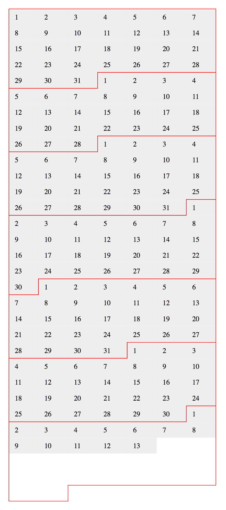

# calendar-layout

layout dates a like a calendar

## TODO:

 * make it configurable which day of the week a week is considered to start, I've set it to be always on a Monday as that's what most calendars use but there are plenty of people who like to start the week on Sunday and I'm sure there are plenty of cases for other days too

 * make some more examples and figure out if the API makes sense -- particularly, I'm not sure about how the month outline works, Might be nicer to be able to draw lines sensibly around arbitrary arrays of dates?